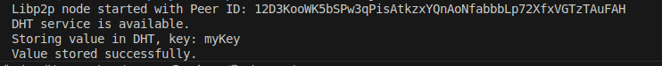

#  Shardspace: The Decentralized Storage Infrastructure

## 🧠 Thesis

**Shardspace** is a decentralized storage infrastructure designed to offer lightweight, browser-native, privacy-preserving file storage. Inspired by **Shamir’s Secret Sharing**, Shardspace enables secure distribution of large data chunks across a peer-to-peer (P2P) network, ensuring no single node holds reconstructable data. It’s built on a stack of **libp2p**, **AES-256-GCM encryption**, **Ethereum smart contracts**, and a custom file transfer protocol powered by **MTProto 2.0**, providing an end-to-end encrypted, censorship-resistant storage solution.

---

The project is under development


## 🧩 What is Shardspace?

Shardspace is a decentralized, encrypted storage system that:
- **Compresses** files , shardspace has high-efficiency lossless compression algorithm that achieves up to 60% file size reduction
- **Splits** compresses files into chunks.
- **Encrypts** each chunk using AES-256-GCM (the same encryption used in WhatsApp).
- **Distributes** these chunks across nodes in a libp2p P2P network.
- **Reconstructs** files securely using a threshold secret recovery model.
- **Rewards** storage providers with blockchain-based incentives (SDP tokens).
- **Runs in the browser**, enabling lightweight nodes without any external infrastructure.

It includes a decentralized file transfer protocol, offering instant, encrypted, and private file sharing between peers — without centralized intermediaries.

---

## 🔐 Key Technologies

- **Shamir’s Secret Sharing (for logic)** — To divide encryption keys or file references into parts.
- **AES-256-GCM** — High-grade authenticated encryption used for securing chunks.
- **MTProto 2.0** — End-to-end encryption protocol used for decentralized file transfer.
- **libp2p** — Core P2P layer for node communication, discovery, and relay.
- **Ethereum** — Smart contracts for metadata storage and reward coordination.
- **Reed-Solomon Erasure Coding** — For reconstructing files from partial chunk data.

---

## ⚙️ Core Architecture
- **Compresses**: Files (right now we have a compression rate of 60%) but we are aiming at advancing to have a 75% ratio.
- **File Splitter + Encryptor**: Files are sliced into finer chunks, encrypted, hashed (SHA-256), and indexed.
- **Distributed Hash Table (DHT)**: Maps encrypted chunks to node locations for decentralized retrieval.
- **Smart Contract Layer**: Stores file metadata, proof-of-storage hashes, and manages SDP token logic.
- **Node Incentives**: Storage Providers (SPs) earn SDP tokens for uptime, availability, and correct retrieval.
- **Custom P2P Transfer Protocol**: Built to handle encrypted file streaming between browser-based nodes.
- **Erasure Coding & Redundancy**: Data redundancy ensures recoverability even when nodes go offline.

---

## 💼 Use Cases

### 🔐 Individual Use-Cases
- **Private Chatrooms** — Build fully encrypted, ephemeral communication tools.
- **Decentralized Vaults** — Secure file lockers where even the host can't see your files.
- **Instant Sharing** — Peer-to-peer file sending with no middleman and zero leaks.

### 🏢 Enterprise Use-Cases
- **Secure File Hosting** — For health, legal, and finance industries that require strict privacy compliance.
- **Decentralized Data Backups** — For distributed teams needing redundant, cost-effective file storage.
- **Blockchain-Based Compliance Systems** — Add auditable storage proof for critical systems.

- etc
---

## 🔄 Token Model

- **SDP Token**: Native utility and reward token for the ecosystem.
- **Earning**: Nodes earn SDP by storing data and passing periodic proof-of-availability checks.
- **Spending**: Users pay for encrypted storage, file retrieval, or enterprise-level features.
- **Penalties**: Offline nodes or manipulated data can be slashed through governance-controlled rules.

---

## 🗺️ Roadmap Summary

-  P2P Layer with libp2p and WebRTC/WebSockets
-  Chunking + AES-256 Encryption
-  MTProto 2.0-based File Transfer
-  DHT-based Chunk Indexing and Lookup
-  Ethereum Smart Contracts for Metadata + Incentives
-  Browser-Native Node Deployment
-  Frontend File Management Interface (Web/Mobile)
-  Open Participation + Mainnet Launch

---

## 🚀 Getting Started

### Prerequisites

Ensure you have the following installed:

### Installation

1. Clone the repository:
   ```bash
   git clone git@github.com:Cref-y/shardspace-db.git
   cd shardspace
   ```

2. Install dependencies:
   ```bash
   npm install
   ```

3. Start the libp2p node:
   ```bash
   node src/node.js
   ```

---

## 📜 License

This project is licensed under the **AGPL License** - see the [LICENSE](LICENSE) file for details.

---

## 🤝 Contributing

Pull requests are welcome! Please follow the contribution guidelines.

---

## 📩 Contact

For support or inquiries, reach out at **crefy@buidlabz.com**.

---
